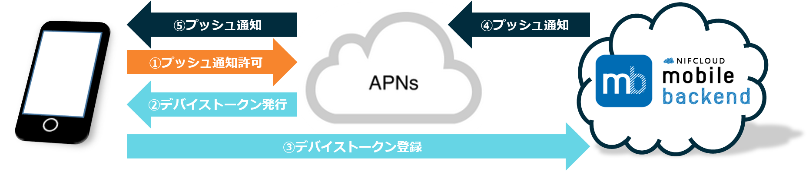
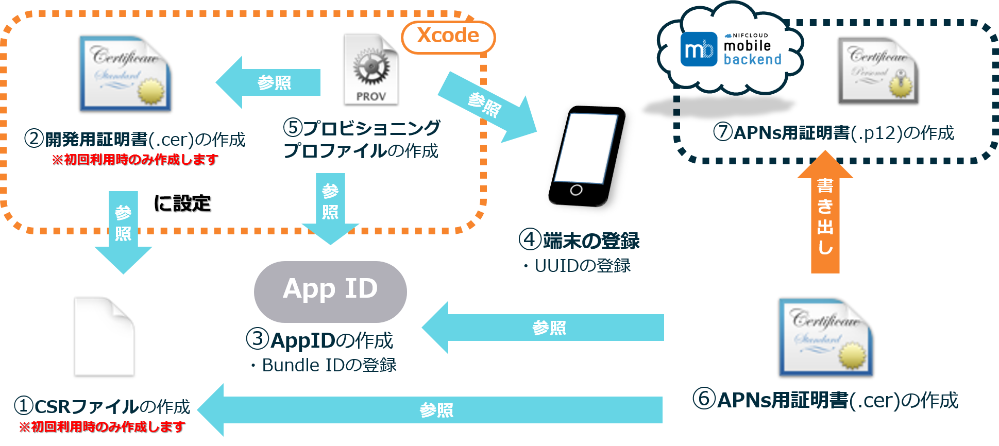
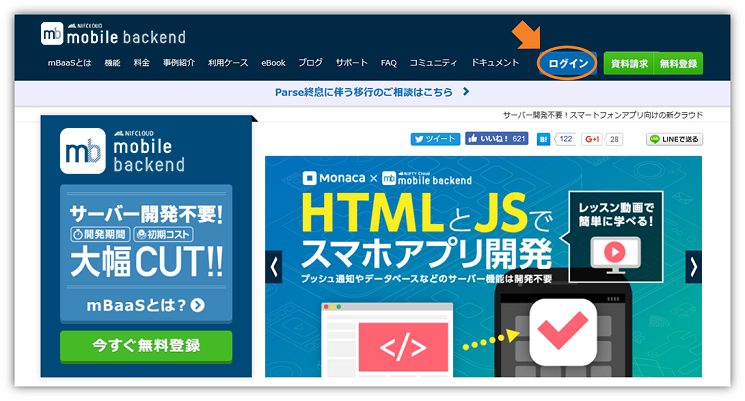
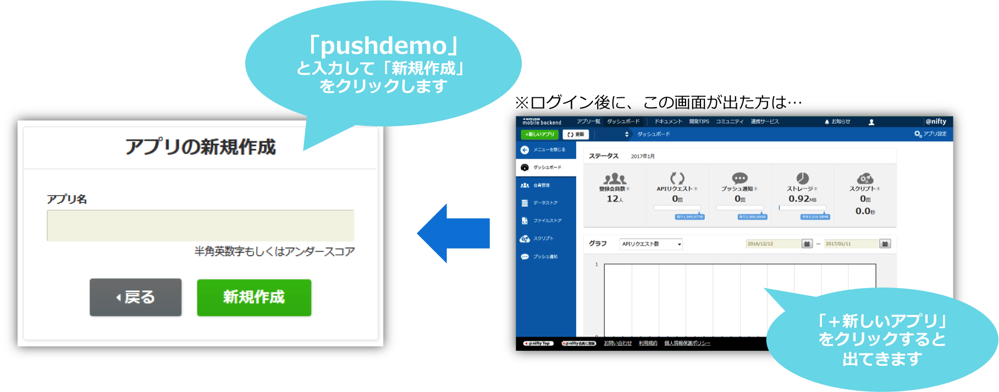
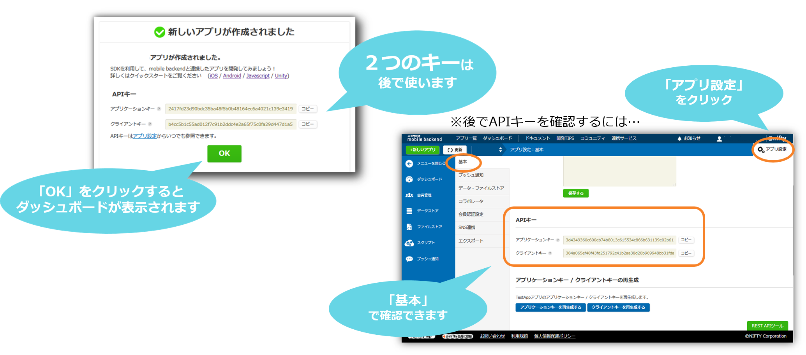
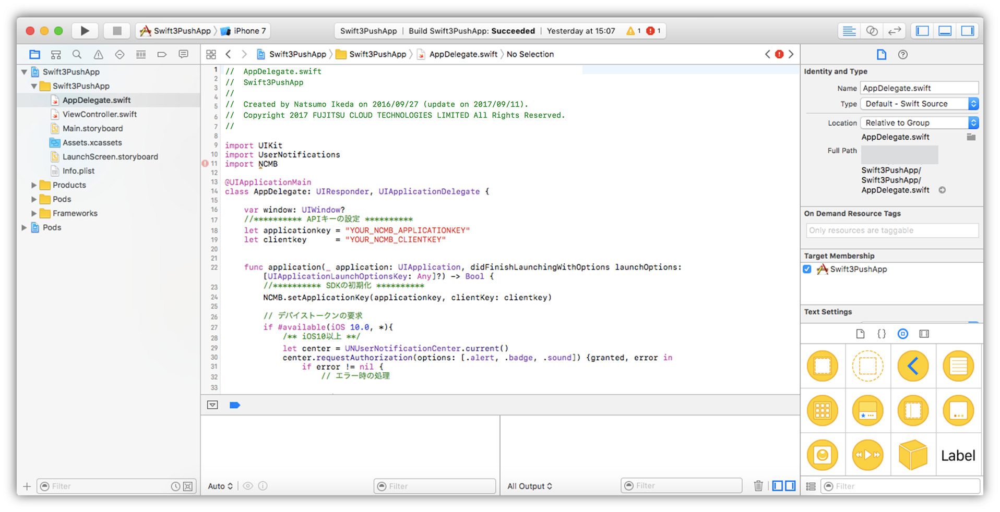

# 【iOS13 Swift】<br>プッシュ通知を組み込もう！
*2016/09/27作成（2020/06/11更新）*

<center></center>

## 概要
* [ニフクラmobile backend](https://mbaas.nifcloud.com/)の『プッシュ通知』機能を実装したサンプルプロジェクトです
* 簡単な操作ですぐに [ニフクラmobile backend](https://mbaas.nifcloud.com/)の機能を体験いただけます★☆
* このサンプルはSwift5(iOS13)に対応しています

## ニフクラmobile backendとは
スマートフォンアプリのバックエンド機能（プッシュ通知・データストア・会員管理・ファイルストア・SNS連携・位置情報検索・スクリプト）が**開発不要**、しかも基本**無料**(注1)で使えるクラウドサービス！

<center></center>

注1：詳しくは[こちら](https://mbaas.nifcloud.com/function.htm)をご覧ください


## 準備
### 準備するもの
* ニフクラmobile backend 会員登録
  * 下記リンクより登録（無料）をお願いします<br>https://mbaas.nifcloud.com/
* Mac
* 動作確認用端末
* Lightning ケーブル

#### 参考：検証済み動作環境
* Mac OS Mojave 10.14.4
* Xcode ver.11.2 (11B52)
* iPhone 8  iOS 13.3
* iPhone XS Max ver. 13.2.2
  * このサンプルアプリは、実機ビルドが必要です

## プッシュ通知の仕組み
* ニフクラmobile backendのプッシュ通知は、iOSが提供している通知サービスを利用しています
 * iOSの通知サービス　__APNs（Apple Push Notification Service）__

<center></center>

* 上図のように、アプリ（Xcode）・サーバー（ニフクラmobile backend）・通知サービス（APNs）の間でやり取りを行うため、認証が必要になります
 * 認証に必要な鍵や証明書の作成は作業手順の「0.プッシュ通知機能使うための準備」で行います

## 作業の手順
### 0.プッシュ通知機能使うための準備
__[【iOS】プッシュ通知の受信に必要な証明書の作り方(開発用)](https://github.com/NIFCLOUD-mbaas/iOS_Certificate)__
* 上記のドキュメントをご覧の上、必要な証明書類の作成をお願いします
 * 証明書の作成には[Apple Developer Program](https://developer.apple.com/account/)の登録（有料）が必要です

<center></center>


### 1. ニフクラmobile backend の準備
* ニフクラmobile backend にログインします
  * サイト https://mbaas.nifcloud.com/ 右上の「ログイン」ボタンをクリックします

<center></center>

* 新しいアプリを作成します
* アプリ名を入力し、「新規作成」をクリックします
  * 例）__PushDemo__

<center></center>

* mobile backend を既に使用したことがある場合は、画面上方のメニューバーにある「+新しいアプリ」をクリックすると同じ画面が表示されます


* アプリ作成されると下図のような画面になります
* この２種類のAPIキー（アプリケーションキーとクライアントキー）はこの後 iOSアプリ との連携のために使用します

<center></center>

* 続けてプッシュ通知の設定を行います
* 「APNs用証明書(.p12)」を設定します

<center></center>

### 2. サンプルプロジェクトのダウンロード

* 下記リンクからプロジェクトをMacにダウンロードします<br> https://github.com/NIFCLOUD-mbaas/SwiftPushApp_iOS13/archive/master.zip


### 3. Xcodeでアプリを起動

* ダウンロードしたフォルダを開き、「__SwiftPushApp.xcworkspace__」をダブルクリックしてXcode開きます(白い方です)
  * 「SwiftPushApp.xcodeproj」（青い方）ではないので注意！

<center></center>

<center></center>

### 4. APIキーの設定

* `AppDelegate.swift`を編集します
* 先程ニフクラmobile backend のダッシュボード上で確認したAPIキーを貼り付けます

<center></center>


* それぞれ `YOUR_NCMB_APPLICATION_KEY` と `YOUR_NCMB_CLIENT_KEY` の部分を書き換えます
 * このとき、ダブルクォーテーション（`"`）を消さないように注意してください！
* 書き換え終わったら`command + s`キーで保存をします

### 5. 実機ビルド
* 始めて実機ビルドをする場合は、Xcodeにアカウント（AppleID）の登録をします
* メニューバーの「Xcode」＞「Preferences...」を選択します
* Accounts画面が開いたら、左下の「＋」をクリックします。
* Apple IDとPasswordを入力して、「Add」をクリックします

<center></center>


* 追加されると、下図のようになります
  * 追加した情報があっていればOKです

<center></center>

* 確認できたら閉じます
* 次に「TARGETS」 ＞「General」を開きます
* 「Idenrity」＞「Bundle Identifier」を入力します
  * AppID 作成時に指定した「Bundle ID」を入力してください

<center></center>

* 次に「TARGETS」 ＞「Signing & Capabilities」を開きます
* 「Teame」を選択します
  * 先ほど「Preferences」で設定したアカウント情報を選択します
  * 「Bundle Identifier」に応じて正しい「Provisioning Profile」が選択されればOKです
  * 正しく読み込まれない場合は、ダウンロードしたプロビジョニングプロファイルを一度 __ダブルクリック__ して読み込んだ後リトライしてください

<center></center>

* 上記画像の下方に表示されている「Push Notifications」はプッシュ通知を利用するために必要な設定です
  * このサンプルでは予め設定してあります
  * 上方「+Capability」から追加できます
* これで準備は完了です

### 6.動作確認
* lightningケーブルで登録した動作確認用iPhoneをMacにつなぎます
* Xcode画面で左上で、接続したiPhoneを選び、実行ボタン（さんかくの再生マーク）をクリックすると端末にアプリがインストールされます
* インストールしたアプリを起動します
  * __注意__：プッシュ通知の許可を求めるアラートが出たら、必ず許可してください！
* 起動されたらこの時点でデバイストークンが取得されます
* ニフクラmobile backend のダッシュボードで「データストア」＞「installation」クラスを確認してみましょう！

<center></center>

* ここで端末側で起動したアプリは一度閉じておきます


### 7. プッシュ通知を送りましょう！
* いよいよです！実際にプッシュ通知を送ってみましょう！
* ニフクラmobile backend のダッシュボードで「プッシュ通知」＞「＋新しいプッシュ通知」をクリックします
* プッシュ通知のフォームが開かれます
* 必要な項目を入力してプッシュ通知を作成します

<center></center>

* 端末を確認しましょう！


* 少し待つとプッシュ通知が届きます！！！

<center></center>

## 解説
サンプルプロジェクトに実装済みの内容のご紹介

#### SDKのインポートと初期設定
* ニフクラmobile backend の[ドキュメント（クイックスタート）](https://mbaas.nifcloud.com/doc/current/introduction/quickstart_swift.html)をSwift版に書き換えたドキュメントをご用意していますので、ご活用ください


#### ロジック
* `AppDelegate.swift`の`didFinishLaunchingWithOptions`メソッド内に、「APNsに対してデバイストークンを要求するコード」を記述しています
  * デバイストークンの要求はiOSのバージョンによってコードが異なるため、場合分けして記述しています

```swift
let center = UNUserNotificationCenter.current()
center.requestAuthorization(options: [.alert, .badge, .sound]) {granted, error in
    if error != nil {
        // エラー時の処理
        return
    }
    if granted {
        // デバイストークンの要求
        UIApplication.shared.registerForRemoteNotifications()
    }
}
```

* デバイストークン取得後、`didRegisterForRemoteNotificationsWithDeviceToken`メソッドが呼ばれ、取得したデバイストークンをニフクラmobile backend 上に保存しています

```swift
// 端末情報を扱うNCMBInstallationのインスタンスを作成
let installation : NCMBInstallation = NCMBInstallation.currentInstallation
// デバイストークンの設定
installation.setDeviceTokenFromData(data: deviceToken)
// 端末情報をデータストアに登録
installation.saveInBackground {result in
    switch result {
        case .success:
            // 端末情報の登録に成功した時の処理
            break
        case let .failure(error):
            // 端末情報の登録に失敗した時の処理
            print(error)
            break
    }
}
```
